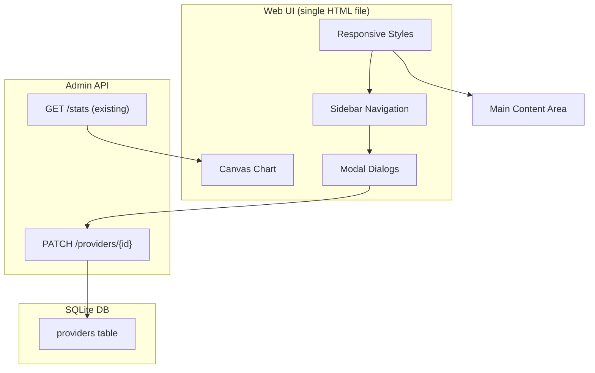

# Admin UI Enhancements — Technical Design

Feature Name: admin-ui-enhancements
Updated: 2026-08-26

## Description

为 AI Gateway 管理后台实现三个增强功能：
1. Provider 编辑功能（PATCH API + 前端表单）
2. 图表可视化（Canvas API 绘制趋势图）
3. 移动端响应式布局（侧边栏折叠/展开）

## Architecture



## Components and Interfaces

### 1. Provider Edit Component

**Location:** `web/index.html` lines 736-757

**Current State:** 占位实现，仅显示 "Edit coming soon"

**Implementation Plan:**
- 扩展 `openEditProvider()` 函数，填充完整表单字段
- 新增 `PATCH /admin/api/providers/{id}` 端点
- 表单字段：name, protocol, baseUrl, apiKey（可选），inputPrice, outputPrice, cachedInputPrice
- API Key 处理：仅当用户填写新值时才加密更新

**API Changes:**
```typescript
// src/admin/api.ts - 新增路由
{ method: 'PATCH', regex: /^\/admin\/api\/providers\/(?<id>[^/]+)$/, paramNames: ['id'], handler: handleUpdateProvider }

// src/storage/repos/providers.ts - 新增方法
update(id: string, updates: { name?: string; protocol?: Protocol; baseUrl?: string; apiKey?: string | null; inputPrice?: number | null; outputPrice?: number | null; cachedInputPrice?: number | null }): void
```

### 2. Chart Component

**Location:** `web/index.html` lines 581-608

**Current State:** 使用简单 div 柱状图

**Implementation Plan:**
- 创建独立的 `renderChart(canvas, data)` 函数
- 使用 Canvas 2D API 绘制：
  - X 轴：日期标签（7 天）
  - Y 轴：数值刻度
  - 柱状图：带圆角的矩形
  - 工具提示：鼠标悬停显示数值
- 响应式绘制：监听 `resize` 事件重绘
- 空数据处理：显示占位文本

**Chart Configuration:**
```javascript
const chartConfig = {
  padding: { top: 20, right: 20, bottom: 40, left: 50 },
  barWidth: '60%',
  barRadius: 4,
  colors: {
    bar: '#3b82f6',
    barHover: '#2563eb',
    grid: '#334155',
    text: '#94a3b8'
  }
};
```

### 3. Responsive Layout

**Location:** `web/index.html` CSS section

**Current State:** 固定宽度侧边栏（220px），无响应式断点

**Implementation Plan:**
- 添加媒体查询断点：`@media (max-width: 768px)`
- 移动端样式：
  - 侧边栏：`transform: translateX(-100%)` 隐藏
  - 汉堡菜单按钮：显示在顶部栏左侧
  - 侧边栏展开：`transform: translateX(0)` + 遮罩层
- 交互逻辑：
  - 点击汉堡菜单 → 展开侧边栏 + 显示遮罩
  - 点击导航项 → 收起侧边栏
  - 点击遮罩 → 收起侧边栏
  - 窗口Resize → 恢复默认状态

**CSS Changes:**
```css
/* Mobile breakpoint */
@media (max-width: 768px) {
  aside { transform: translateX(-100%); transition: transform 0.3s; }
  aside.open { transform: translateX(0); }
  .sidebar-overlay { display: none; position: fixed; inset: 0; background: rgba(0,0,0,0.5); z-index: 99; }
  .sidebar-overlay.visible { display: block; }
  .hamburger { display: flex; }
  .main-wrap { margin-left: 0; }
}

/* Desktop */
@media (min-width: 769px) {
  aside { transform: translateX(0); }
  .hamburger { display: none; }
}
```

## Data Models

### Provider Update Input
```typescript
interface ProviderUpdateInput {
  name?: string;
  protocol?: 'OpenAI' | 'OpenAI-Compatible' | 'Anthropic' | 'Gemini' | 'Doubao' | 'Wenxin';
  baseUrl?: string;
  apiKey?: string | null;  // null means keep existing
  inputPrice?: number | null;
  outputPrice?: number | null;
  cachedInputPrice?: number | null;
}
```

### Chart Data
```typescript
interface ChartDataPoint {
  label: string;  // e.g., "2026-08-20"
  value: number;  // request count or cost
}

interface ChartData {
  series: ChartDataPoint[];
  max: number;
}
```

## Correctness Properties

1. **Provider Update Integrity**: 更新操作必须保持 provider_id 不变，仅更新可变字段
2. **API Key Preservation**: 未提供新 API Key 时，必须保留现有加密值
3. **Chart Responsiveness**: 窗口 resize 后图表必须正确重绘，不出现裁剪或空白
4. **Mobile UX Consistency**: 移动端侧边栏展开/收起必须有平滑过渡动画（0.3s）

## Error Handling

### Provider Update Errors
- **404 Not Found**: Provider ID 不存在 → 显示 "Provider not found" 错误提示
- **400 Bad Request**: 必填字段缺失 → 显示字段验证错误
- **500 Internal Error**: 数据库写入失败 → 显示通用错误提示

### Chart Errors
- **No Data**: series 数组为空 → 显示占位文本
- **Canvas Error**: 初始化失败 → 降级为简单表格显示

### Mobile Errors
- **Touch Events**: 确保触摸事件正确触发菜单展开/收起
- **Overflow**: 侧边栏展开时内容区不溢出

## Test Strategy

### Unit Tests (Backend)
```typescript
// test/unit/admin/api.test.ts
describe('PATCH /admin/api/providers', () => {
  it('updates provider name and baseUrl', async () => { ... });
  it('encrypts new API key', async () => { ... });
  it('preserves existing API key when not provided', async () => { ... });
  it('returns 404 for non-existent provider', async () => { ... });
});
```

### Manual Tests (Frontend)
1. 编辑 Provider 表单验证
2. API Key 加密验证（检查数据库）
3. 图表渲染验证（不同数据量）
4. 移动端布局验证（768px 断点）
5. 触摸交互验证（汉堡菜单）

## References

[^1]: (File#L736) `web/index.html` - Current edit provider placeholder
[^2]: (File#L581) `web/index.html` - Current dashboard chart implementation
[^3]: (File#L8) `web/index.html` - Current CSS variables and layout
