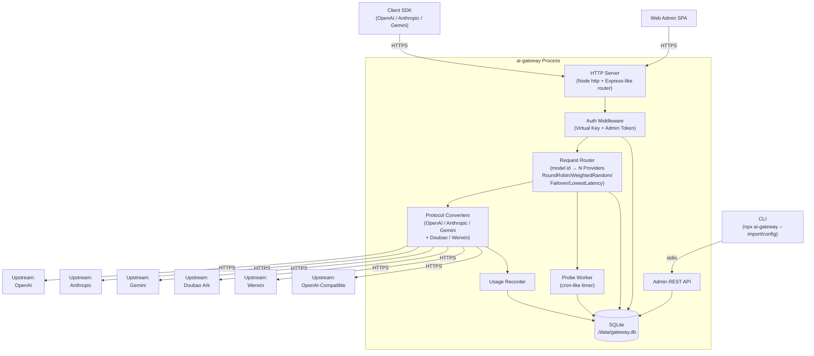
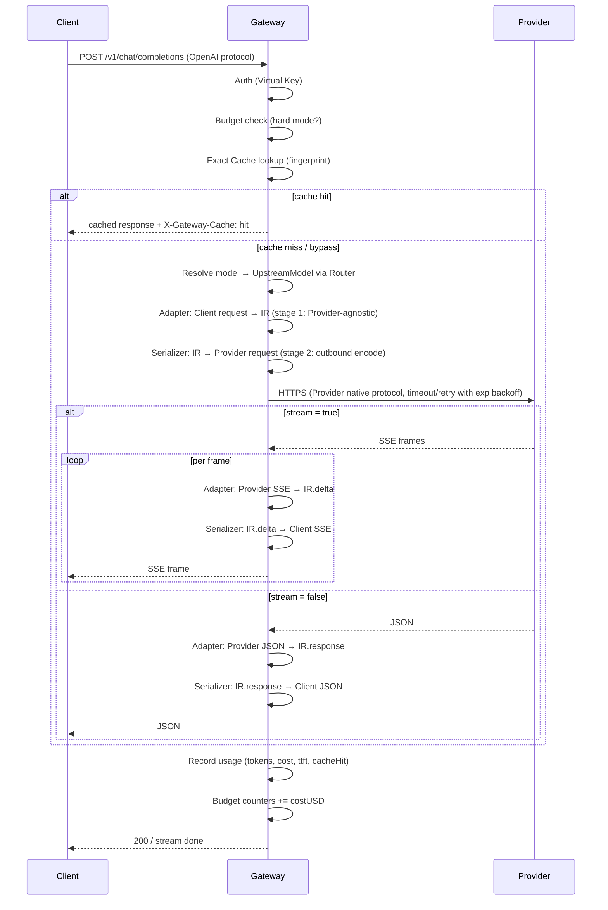

# AI Gateway — Technical Design

Feature Name: ai-gateway
Updated: 2026-08-25

## Description

`ai-gateway` 是本地优先的 npm 包形态 AI API 网关，单一 Node.js 进程承载 HTTP 客户端入口、协议转换、虚拟模型路由、Probe、Key 鉴权、用量计量、Web 管理后台与 CLI。它把 6 类上游 API（OpenAI、OpenAI-Compatible、Anthropic、Google Gemini、豆包 Ark、文心千帆）通过内部协议无关表示统一接入，再以 4 种 Client Protocol 出口（OpenAI Chat Completions、OpenAI Responses、Anthropic Messages、Gemini GenerateContent）对外暴露，按策略在多个 Upstream Model 间路由，并在故障时自动跳过不可用模型。**形态：多 API 进，四协议出。**

包通过 `npx ai-gateway` 启动，使用 better-sqlite3 持久化配置与用量。Web 后台以单文件 HTML + 原生 JS 实现，无前端构建步骤。CLI 与管理 REST API 暴露完全相同的配置能力。

### 形态总览（多 API 进，四协议出）

```
        ┌─────────────────────── Provider 入口（6 类 API） ───────────────────────┐
        │  OpenAI │ OpenAI-Compatible │ Anthropic │ Gemini │ Doubao │ Wenxin   │
        └─────────────────────────────┬──────────────────────────────────────────┘
                                      │ 阶段一 Adapter → IR
                                      ▼
                          ┌──────────────────────┐
                          │   IR（内部表示）      │
                          └──────────┬───────────┘
                                     │ 阶段二 Serializer
        ┌────────────────────────────┴──────────────────────────────────────────┐
        │                 Client Protocol 出口（4 种）                          │
        │  OpenAI Chat Completions │ OpenAI Responses                           │
        │  Anthropic Messages      │ Gemini GenerateContent                     │
        └────────────────────────────────────────────────────────────────────────┘
```

## Architecture

### 分层视图



### 请求生命周期（客户端 → 上游 → 客户端）



### 协议转换矩阵

设计上采用 **Provider 入口 × Client 出口** 的二阶段转换：先把 6 类 Provider API 翻译为内部协议无关表示（IR），再从 IR 序列化为 4 种 Client Protocol 出口。

**阶段一：Provider → IR（6 类入口归一）**

| Provider API | 入口归一策略 |
|---|---|
| OpenAI | 直接映射到 IR |
| OpenAI-Compatible | 直接映射到 IR（与 OpenAI 同构） |
| Anthropic | 转换为 IR（system 数组拼接、tool_use 块转 IR.tool_calls、thinking 字段转 IR.thinking） |
| Gemini | 转换为 IR（contents 角色归一、functionCall ↔ IR.tool_calls、thoughts 转 IR.thinking） |
| Doubao | 走 OpenAI-Compatible 路径，按 OpenAI body 转换 IR |
| Wenxin | 走 OpenAI-Compatible 路径，按 OpenAI body 转换 IR |

**阶段二：IR → Client Protocol（4 种出口）**

| IR \ Client | OpenAI Chat | OpenAI Responses | Anthropic | Gemini |
|---|---|---|---|---|
| IR | 直传 | 转换（messages → input items，output items 流式） | 转换（tool_calls → tool_use blocks、流式 content_block_*） | 转换（tool_calls → functionCall、contents 角色反推） |

由于阶段一已把 6 类入口归一，阶段二只需 4 个出口序列化器，避免了 6×4=24 个直接转换对的组合爆炸。

## Components and Interfaces

### 1. HTTP Server（`src/server/http.ts`）

- 基于 Node `http` 标准库 + 自研轻量路由（避免 Express 依赖，减少 npm 包体积）。
- 路由前缀：
  - `POST /v1/chat/completions` — OpenAI Chat Completions 入口
  - `POST /v1/responses` — OpenAI Responses 入口
  - `POST /v1/responses/:response_id` — OpenAI Responses 单项查询
  - `POST /v1/messages` — Anthropic Messages 入口
  - `POST /v1/messages/count_tokens` — Anthropic Token 计数
  - `POST /v1beta/models/:model\\:action` — Gemini 入口（generateContent / streamGenerateContent / countTokens）
  - `GET /v1/models` — 模型列表
  - `GET /v1beta/models` — Gemini 模型列表
  - `GET /admin` — Web 后台入口（返回单文件 HTML）
  - `GET /admin/api/*` — 管理 REST API（受 Admin Token 保护）
  - `GET /metrics` — Prometheus 指标（受 Admin Token 保护）
  - `GET /healthz` — 存活探针
- 流式响应通过 `res.write` + `Content-Type: text/event-stream` 实现。Responses 流式 event 命名空间为 `response.*`（如 `response.created`、`response.output_text.delta`），与 OpenAI 官方规范一致。

### 2. Auth Middleware（`src/server/middleware/auth.ts`）

- 解析 `Authorization: Bearer <key>`。
- 计算 SHA-256 摘要并查表。
- 校验 Key 状态（active/revoked）、rpm/tpm 限额、allowedModels 白名单。
- Admin Token 仅作用于 `/admin/*`，与 Virtual Key 分桶存储。

### 3. Request Router（`src/router/index.ts`）

**职责**：按 client 请求中的 `model` 字段，先匹配 VirtualModel 选择一个 Upstream Member，再回退到 UpstreamModel 直接转发。

#### 3.1 解析阶段

1. 读取 `req.body.model`，去除前后空白。
2. 在内存中的 `virtualModelIndex: Map<name, VirtualModel>` 查找命中：
   - 命中 → 进入 3.2 路由策略选择；
   - 未命中 → 在 `upstreamModelIndex: Map<modelId, UpstreamModel>` 查找命中后直传该 UpstreamModel（仍受 availability 与 Probe 约束）。
3. 命中的 `(providerId, providerModelId)` 同时通过 `availabilityCache` 校验状态为 `available` 或 `degraded`；否则跳过该候选；若所有候选都不可用，返回 502 `all_upstreams_unavailable`。

#### 3.2 路由策略（4 种）

每种策略在选择完成后写入 `req.gateway.routedProviderId` 与 `req.gateway.routedModelId`，由 HTTP 层在响应中以头暴露。

| Strategy | 算法 |
|---|---|
| `RoundRobin` | 进程内原子计数器 `roundRobinCounters[virtualModelId]++` 取模成员数；多个 Provider 实例按加入顺序循环，确保各 Provider 实例被均匀访问。 |
| `WeightedRandom` | 按成员 weight 计算累计权重数组，`crypto.randomInt(0, totalWeight)` 落在哪一段就选哪个；权重全为 0 返回 400 `invalid_weights`。 |
| `Failover` | 按 priority 升序遍历成员，跳过 `availabilityCache.status === 'unavailable'` 的实例；首个可用即返回。 |
| `LowestLatency` | 维护 `latencyWindow` 大小的滑动窗口（默认 5 次 Probe 平均），跳过 unavailable 实例；同延迟时按 priority 升序兜底。 |

#### 3.3 多协议透明

当选中的成员来自不同协议家族（例：OpenAI 直连 + Anthropic 兼容中转），Router 不感知协议差异——所有成员都先归一为 IR，再由 Provider Adapter 还原为目标 Provider 请求体；Client Serializer 再按 Client Protocol 序列化出口。同一 Virtual Model 跨协议成员的 routing 因此对客户端透明。

#### 3.4 Dry-run

`POST /admin/api/virtual-models/:id/dry-run` 不实际调用 Provider，仅根据当前 availability 与权重选择逻辑返回将命中的成员 id，便于运维调试。

#### 3.5 响应头

| Header | 含义 |
|---|---|
| `X-Gateway-Routed-Provider` | 实际命中的 providerId |
| `X-Gateway-Routed-Model` | 实际命中的 providerModelId |
| `X-Gateway-Routed-Strategy` | 命中的路由策略 |

### 4. Protocol Converters（两阶段：adapters + clients）

#### 4.1 Provider Adapters（`src/adapters/`，入口归一）

每个 Adapter 实现 `toIR(request) → IR` 与 `fromIR?(response | stream) → ProviderResponse`，**只关心把 Provider 协议翻译为 IR 或从 IR 还原 Provider 响应**。

- `openai.ts` — OpenAI ↔ IR。基线。
- `openai-compatible.ts` — 与 OpenAI 同构，差异化只在鉴权头（部分中转要求 `Authorization: Bearer` 而非 OpenAI 标准）和路径差异（如 `/v1/chat/completions` vs `/v2/chat/completions`）。
- `anthropic.ts` — Anthropic Messages → IR。处理 system 数组拼接、tool_use 块 → IR.tool_calls、thinking 字段 → IR.thinking、cache_control 标记。
- `gemini.ts` — Gemini GenerateContent → IR。contents 角色归一、functionCall → IR.tool_calls、thoughts → IR.thinking。
- `doubao.ts` — 豆包 Ark：复用 `openai-compatible.ts` 主体，覆盖 baseUrl（默认 `https://ark.cn-beijing.volces.com/api/v3`）与鉴权头。
- `wenxin.ts` — 文心千帆：复用 `openai-compatible.ts` 主体，覆盖 OAuth2 client_credentials 获取 access_token、`POST {baseUrl}/v2/chat/completions`、message role=system 数组拼接。

#### 4.2 Client Serializers（`src/clients/`，出口序列化）

每个 Serializer 实现 `serialize(ir, options) → ClientResponse | AsyncIterable<ClientEvent>`，**只关心从 IR 序列化为 4 种 Client Protocol**。

- `openai-chat-client.ts` — IR → OpenAI Chat Completions（直传）。
- `openai-responses-client.ts` — IR → OpenAI Responses。处理：
  - `IR.messages` → `input` 数组（message / function_call / function_call_output / reasoning item 类型）；
  - `IR.tools` 中 `provider_executed: true` 的内置工具（web_search、code_interpreter、file_search）按 Responses 规范原样输出到 `tools` 字段；
  - 流式 event：`response.created` → `response.in_progress` → `response.output_text.delta` → `response.output_item.added` → `response.output_item.done` → `response.completed`，每个 event 携带同一 `response` 对象引用；
  - `previous_response_id` 在请求中透传 Provider，响应写入 `response_cache` 表供后续 `POST /v1/responses/:id` 单项查询。
- `anthropic-client.ts` — IR → Anthropic Messages。处理 IR.tool_calls → tool_use 块、流式 content_block_start / content_block_delta / content_block_stop、IR.thinking → thinking blocks、cache_control 还原。
- `gemini-client.ts` — IR → Gemini GenerateContent。处理 IR.tool_calls → functionCall、contents 角色反推、IR.thinking → thoughts。

#### 4.3 Bus（`src/protocol-bus.ts`）

- 接收 `(clientProtocol, providerProtocol)`，选择对应 Serializer × Adapter 对。
- 缺失组合（如 Client=Anthropic × Provider=Anthropic）走直通路径（直传）。
- 缺失能力时返回 `unsupported_capability` 错误。

由于阶段一已把 6 类入口归一为 IR，阶段二只需 4 个 Serializer × 6 个 Adapter = 24 个组合，但其中 Adapter 实现极薄（多数走 OpenAI-compatible 模板），新增 Provider 只需新增一个 Adapter 文件。

#### 4.4 IR（内部协议无关表示，`src/ir/types.ts`）

```ts
type IRMessage = { role: 'system' | 'user' | 'assistant' | 'tool'; content: IRContent[]; name?: string };
type IRContent = IRText | IRImage | IRAudio | IRToolUse | IRToolResult | IRThinking;
type IRToolUse = { id: string; name: string; arguments: unknown };
type IRToolResult = { toolCallId: string; content: string | IRContent[]; isError?: boolean };
type IRThinking = { text: string; signature?: string };
type IRReasoning = { effort?: 'low' | 'medium' | 'high'; summary?: 'auto' | 'concise' | 'detailed'; encryptedContent?: string };
type IRTool = { name: string; description?: string; parameters: unknown; providerExecuted?: boolean; builtinKind?: 'web_search' | 'code_interpreter' | 'file_search' };
type IRRequest = { model: string; messages: IRMessage[]; tools?: IRTool[]; toolChoice?: 'auto' | 'none' | { name: string }; reasoning?: IRReasoning; continuation?: { previousResponseId?: string; conversationId?: string }; temperature?: number; topP?: number; maxTokens?: number; stop?: string[]; responseFormat?: IRResponseFormat; stream: boolean; metadata?: Record<string, unknown> };
type IRResponse = { id: string; model: string; choices: IRChoice[]; usage: IRUsage; finishReason: IRFinishReason; reasoning?: IRReasoning; outputItems?: IROutputItem[] };
type IRUsage = { promptTokens: number; completionTokens: number; cachedTokens: number; totalTokens: number };
type IRFinishReason = 'stop' | 'length' | 'tool_calls' | 'content_filter' | 'error';
type IROutputItem = IRTextOutputItem | IRFunctionCallItem | IRFunctionCallOutputItem | IRReasoningItem | IRWebSearchItem;
```

### 5. Probe Worker（`src/probe/worker.ts`）

- 启动时建立 `setInterval`，间隔取自 `probeIntervalMinutes`（0 关闭）。
- 每轮遍历所有 enabled `(providerId, providerModelId)` 组合，对每个发送最小化探测请求（OpenAI/Anthropic/Gemini 使用 `max_tokens: 1`；豆包、文心同样使用 1 token）。
- 写入 `probe_results` 表（latency、statusCode、success、errorMessage、probedAt）。
- 维护内存中的 `availabilityCache`，每个 Upstream Model 维护三态状态机：
  - `available` — 正常路由；
  - `degraded` — 最近 `latencyWindow` 次 Probe 成功率 < 80%，仍参与路由但 Router 会在 LowestLatency 策略中降低其优先级；
  - `unavailable` — 连续失败 ≥ failureThreshold，不参与路由。
- 状态机迁移规则：
  - `available` → `degraded`：最近 N 次 Probe 成功率 < 80%；
  - `available/degraded` → `unavailable`：连续失败 ≥ failureThreshold；
  - `unavailable` → `available`：连续成功 ≥ recoveryThreshold。
- 真实请求收到 5xx/超时时同步调用 `availabilityCache.recordFailure(modelId)`，按上述规则推进状态机。
- `GET /v1/models` 在每个 model 的 `metadata.availability` 中暴露 `availabilityCache.status`；`metadata.endpoints` 数组列出每个 `(providerId, providerModelId)` 实例的 availability、latencyMsP50、latencyMsP95。

### 6. Usage Recorder（`src/usage/recorder.ts`）

- 在响应完成或 SSE `[DONE]` 时记录一行。
- 字段：requestId、keyId、virtualModelId、upstreamProviderId、upstreamModelId、promptTokens、completionTokens、cachedTokens、totalTokens、costUSD、source（reported/estimated）、cacheHit（none/exact）、ttftMs、tokensPerSecond、latencyMs、statusCode、createdAt。
- costUSD = (promptTokens - cachedTokens) * inputPrice / 1e6 + cachedTokens * cachedInputPrice / 1e6 + completionTokens * outputPrice / 1e6。
- 估算规则：当上游未返回 usage 时按字符数 / 4 向下取整，source = estimated。
- 流式请求在首个内容帧到达时打点 ttftMs，在流结束时计算 tokensPerSecond = completionTokens / (latencyMs - ttftMs) * 1000。

### 6a. Budget Tracker（`src/budget/tracker.ts`）

- 内存计数器 + SQLite 持久化：`budgetCounters: Map<keyId, { day: { dateKey, spentUsd }, month: { monthKey, spentUsd }, total: number }>`。
- 每次请求计费后累加，达到 80% 阈值时写 `events` 表（type=budget_warning，同一周期同一阈值去重）。
- `budgetMode = hard` 时超额返回 402 `budget_exceeded`（错误体含 exceededBudget / spentUsd / budgetUsd）；`soft` 仅记录事件。
- 日/月周期按 UTC 日界与自然月切换，切换时自动清零并归档。

### 6b. Cache Manager（`src/cache/manager.ts`）

- Exact Cache 实现：内存 LRU（`lru-cache` 模式自实现，容量 `cacheMaxEntries` 默认 1000）+ 可选 SQLite 持久层（进程重启后热身）。
- 指纹算法：对 `{ model, messages(规范化排序), temperature, top_p, max_tokens, tools, tool_choice, response_format, seed? }` 做 JSON 稳定序列化（键排序）后 SHA-256。
- 命中路径在 Auth 之后、Router 之前执行，命中时直接走 Client Serializer 返回，附加 `X-Gateway-Cache: hit`。
- 流式请求（stream=true）直接 bypass；tools/tool_choice 完整参与指纹，防止工具差异误命中。
- `cacheHit` 枚举预留 `semantic` 值（二期语义缓存接口位）。
- 管理 API：`DELETE /admin/api/cache` 清空、`GET /admin/api/cache/stats` 返回命中率/条目数/TTL 分布。

### 6c. Retry Policy（`src/upstream/retry.ts`）

- Retryable Error 分类：HTTP 408 / 429 / 5xx + 网络层错误（ECONNRESET、ETIMEDOUT、DNS、TLS）。
- 指数退避：`delay(n) = baseMs * 2^(n-1) + random(0, jitterMs)`，baseMs=500、jitterMs=500，maxRetries 由 Virtual Model 配置（默认 2）。
- 上游 429 携带 `Retry-After` 时以 `max(retryAfter*1000, delay(n))` 覆盖。
- 重试预算：滑动 60 秒窗口内 `retries / totalRequests > retryBudgetRatio(0.2)` 时熔断重试、直接透传错误，窗口恢复后自动解除。

### 6d. Metrics & OTel Exporter（`src/observability/`）

- `metrics.ts`：进程内聚合器，输出 Prometheus 文本格式到 `GET /metrics`：
  - `gateway_requests_total{key,model,provider,status}` Counter
  - `gateway_tokens_total{key,model,type=prompt|completion|cached}` Counter
  - `gateway_cost_usd_total{key,model}` Counter
  - `gateway_request_duration_ms_bucket` Histogram（le: 50/100/250/500/1000/2500/5000/10000）
  - `gateway_ttft_ms_bucket` Histogram（le: 100/250/500/1000/2000/5000）
  - `gateway_cache_hits_total{type}` Counter
  - `gateway_upstream_available{provider,model}` Gauge（1/0）
  - `gateway_budget_usage_ratio{key}` Gauge（0-1+）
- `otel.ts`：可选 OTLP/gRPC Span 导出（配置 `otelExporterOtlpEndpoint` 时启用），遵循 GenAI 语义约定属性族 `gen_ai.*`（gen_ai.system、gen_ai.request.model、gen_ai.response.model、gen_ai.usage.input_tokens、gen_ai.usage.output_tokens、gen_ai.operation.name），流式请求记录 `ttft` 与 `stream_completed` 两个 span 事件。
- `request-logs.ts`：Key 级 `logRequests` 开启时按采样率写入 `request_logs` 表；脱敏正则覆盖 `sk-\w+`、`Bearer\s+\S+`、`AKIA[0-9A-Z]{16}`、`ghp_\w+`、`-----BEGIN.*KEY-----` 等模式。

### 7. Admin REST API（`src/admin/api.ts`）

| Method | Path | 说明 |
|---|---|---|
| GET | `/admin/api/providers` | 列出所有 Provider |
| POST | `/admin/api/providers` | 新建 Provider |
| PATCH | `/admin/api/providers/:id` | 更新 Provider |
| DELETE | `/admin/api/providers/:id` | 删除 Provider |
| POST | `/admin/api/providers/:id/sync-models` | 触发模型同步 |
| GET | `/admin/api/virtual-models` | 列出虚拟模型 |
| POST | `/admin/api/virtual-models` | 创建虚拟模型 |
| GET | `/admin/api/virtual-models/:id` | 虚拟模型详情（含所有成员） |
| PATCH | `/admin/api/virtual-models/:id` | 更新虚拟模型（strategy、成员、权重、priority） |
| DELETE | `/admin/api/virtual-models/:id` | 删除虚拟模型 |
| GET | `/admin/api/virtual-models/:id/availability` | 虚拟模型所有成员的 availability 状态 |
| POST | `/admin/api/virtual-models/:id/dry-run` | 模拟路由选择，返回将命中的成员 id |
| GET | `/admin/api/availability` | 全量 UpstreamModel 可用性快照 |
| GET | `/admin/api/keys` | 列出 Key（不返回明文） |
| POST | `/admin/api/keys` | 创建 Key（返回一次明文） |
| DELETE | `/admin/api/keys/:id` | 吊销 Key |
| GET | `/admin/api/keys/:id/budget` | Key 预算计数器与告警状态 |
| POST | `/admin/api/keys/:id/budget/reset` | 重置指定周期预算计数器 |
| GET | `/admin/api/keys/:id/events` | Key 相关事件流（预算告警、降级等） |
| DELETE | `/admin/api/cache` | 清空 Exact Cache |
| GET | `/admin/api/cache/stats` | 缓存命中率、条目数、TTL 分布 |
| GET | `/admin/api/logs?requestId=...` | 请求响应审计（含路由决策与耗时分解） |
| GET | `/metrics` | Prometheus 文本格式指标（受 Admin 鉴权保护） |
| GET | `/admin/api/usage?groupBy=...&range=...` | 用量聚合 |
| GET | `/admin/api/usage/timeseries?bucket=hour&range=24h` | 时序聚合 |
| GET | `/admin/api/stats/totals` | 总量统计（请求数、Token、费用、活跃 Key、平均延迟） |
| GET | `/admin/api/stats/distribution?dimension=provider\|model\|key&range=24h` | 占比分布 |
| GET | `/admin/api/stats/latency?range=24h` | P50/P95/P99 延迟分位数 |
| GET | `/admin/api/stats/error-rate?range=24h` | 错误率与错误码 Top10 |
| GET | `/admin/api/stats/top-models?limit=10&range=7d&by=cost\|tokens\|requests` | Top 模型榜单 |
| GET | `/admin/api/stats/heatmap?dimension=hour-of-day×day-of-week&range=30d` | 流量热力图 |
| GET | `/admin/api/stats/routing-distribution?range=24h` | VirtualModel 路由命中分布（每成员命中数） |
| GET | `/admin/api/stats/provider-availability-matrix` | Provider × UpstreamModel 可用性矩阵 |
| POST | `/admin/api/test` | 发送一次真实请求用于连通性测试 |
| GET | `/admin/api/probe-results?modelId=...&range=24h` | 探测历史 |

### 8. CLI（`src/cli/index.ts`）

- `npx ai-gateway` — 启动服务。
- `npx ai-gateway --config <path>` — 以配置文件覆盖默认。
- `npx ai-gateway --import <path>` — 导入 JSON 配置后退出（用于初始化）。
- `npx ai-gateway --export <path>` — 导出当前配置到 JSON。
- `npx ai-gateway --reset-keys` — 清空所有 Key（带确认提示）。
- `npx ai-gateway --version` — 输出版本号。

### 9. Web Admin SPA（`web/index.html`）

- 单文件 HTML + 原生 ES2022 JS，无构建步骤。
- 七个 Tab：
  - **Overview** — 仪表盘（见下）
  - **Providers** — Provider CRUD + 模型同步
  - **Virtual Models** — 虚拟模型路由配置
  - **Keys** — Virtual Key 管理
  - **Usage** — 用量明细 + 时序图
  - **Probes** — 上游探测历史与延迟曲线
  - **Settings** — 全局参数（探测间隔、阈值、master key 重置）
- 走 `fetch('/admin/api/*')` + Admin Token（首次访问弹窗输入并存 `sessionStorage`）。
- 使用 `EventSource('/admin/api/logs/stream')`（可选）查看实时日志。

### 10. Dashboard 仪表盘（Overview Tab）

Overview Tab 默认进入，按 `range=24h` 加载七组指标，使用 SVG 自绘图表（不引入 Chart.js/ECharts，保持零依赖）。布局如下：

```
┌─────────────────────────────────────────────────────────────┐
│  [KPI 卡片] 总请求 / 总 Tokens / 总费用 / 活跃 Key / P95    │
├─────────────────────────────────────────────────────────────┤
│  [模型可用性卡片条]  全部 │ Available │ Degraded │ Unavail. │
├──────────────────────────┬──────────────────────────────────┤
│  时序面积图 (24h)        │  错误率折线 (24h)                │
│  Requests × Tokens       │                                  │
├──────────────────────────┼──────────────────────────────────┤
│  Provider 占比环形图     │  Top 模型柱状 (by cost)         │
├──────────────────────────┼──────────────────────────────────┤
│  P50/P95/P99 延迟柱      │  Key 用量 Top10 横向柱           │
├──────────────────────────┼──────────────────────────────────┤
│  VirtualModel 路由命中分布 │  Provider 实例可用性矩阵        │
├──────────────────────────┴──────────────────────────────────┤
│  30 天流量热力图 (hour × weekday)                            │
└─────────────────────────────────────────────────────────────┘
```

新增可视化：

- **模型可用性卡片条**：四格（全部 / Available / Degraded / Unavailable），数字取自 `/admin/api/availability`。
- **VirtualModel 路由命中分布**：堆叠柱图，x 轴是 VirtualModel name，y 轴是请求数，按命中成员堆叠颜色（每成员一色）；用于一眼看出每个 model id 的流量在多个服务商间如何分配。
- **Provider 实例可用性矩阵**：行为 Provider，列为 UpstreamModelId，单元格颜色按 availability 着色（绿/黄/红），便于识别"哪个 Provider 的哪个模型"在降级。

实现细节：

- 所有图表统一走 `src/web/charts/*.js`，每个图表一个独立 `render(svg, data)` 函数。
- 图表数据按 range 懒加载，切 range 时统一请求 `/admin/api/stats/*`。
- 数字滚动动画（200ms ease-out，从旧值到新值）。
- 颜色调色板：6 色调和板（紫/青/琥珀/红/绿/蓝），按 Provider id 哈希分配，保证稳定。
- 空态：当没有 usage 数据时显示「等待第一条请求」占位。

## Data Models

### SQLite Schema（`src/storage/schema.sql`）

```sql
CREATE TABLE providers (
  id TEXT PRIMARY KEY,
  name TEXT NOT NULL,
  protocol TEXT NOT NULL CHECK (protocol IN ('OpenAI','OpenAI-Compatible','Anthropic','Gemini','Doubao','Wenxin')),
  base_url TEXT NOT NULL,
  api_key_ciphertext TEXT NOT NULL,
  api_key_iv TEXT NOT NULL,
  api_key_tag TEXT NOT NULL,
  enabled INTEGER NOT NULL DEFAULT 1,
  input_price_per_mtokens_usd REAL,
  output_price_per_mtokens_usd REAL,
  cached_input_price_per_mtokens_usd REAL,
  extra_json TEXT,
  created_at INTEGER NOT NULL,
  updated_at INTEGER NOT NULL
);

CREATE TABLE provider_models (
  id TEXT PRIMARY KEY,
  provider_id TEXT NOT NULL REFERENCES providers(id) ON DELETE CASCADE,
  model_id TEXT NOT NULL,
  display_name TEXT,
  context_window INTEGER,
  supports_stream INTEGER NOT NULL DEFAULT 1,
  supports_tools INTEGER NOT NULL DEFAULT 1,
  supports_vision INTEGER NOT NULL DEFAULT 0,
  enabled INTEGER NOT NULL DEFAULT 1,
  availability TEXT NOT NULL DEFAULT 'available' CHECK (availability IN ('available','degraded','unavailable')),
  consecutive_failures INTEGER NOT NULL DEFAULT 0,
  consecutive_successes INTEGER NOT NULL DEFAULT 0,
  last_probe_at INTEGER,
  unavailable_since INTEGER,
  latency_ms_p50 INTEGER,
  latency_ms_p95 INTEGER,
  created_at INTEGER NOT NULL,
  UNIQUE (provider_id, model_id)
);

CREATE TABLE virtual_models (
  id TEXT PRIMARY KEY,
  name TEXT NOT NULL UNIQUE,
  strategy TEXT NOT NULL CHECK (strategy IN ('RoundRobin','WeightedRandom','Failover','LowestLatency')),
  latency_window INTEGER DEFAULT 5,
  failure_threshold INTEGER DEFAULT 3,
  recovery_threshold INTEGER DEFAULT 2,
  max_retries INTEGER NOT NULL DEFAULT 2,
  fallback_chain_json TEXT,
  created_at INTEGER NOT NULL
);

CREATE TABLE virtual_model_members (
  virtual_model_id TEXT NOT NULL REFERENCES virtual_models(id) ON DELETE CASCADE,
  upstream_model_id TEXT NOT NULL REFERENCES provider_models(id) ON DELETE CASCADE,
  weight INTEGER NOT NULL DEFAULT 1,
  priority INTEGER NOT NULL DEFAULT 100,
  enabled INTEGER NOT NULL DEFAULT 1,
  joined_at INTEGER NOT NULL,
  PRIMARY KEY (virtual_model_id, upstream_model_id)
);

CREATE TABLE keys (
  id TEXT PRIMARY KEY,
  name TEXT NOT NULL,
  key_hash TEXT NOT NULL UNIQUE,
  prefix TEXT NOT NULL,
  status TEXT NOT NULL CHECK (status IN ('active','revoked')) DEFAULT 'active',
  rpm_limit INTEGER,
  tpm_limit INTEGER,
  allowed_models_json TEXT,
  response_cache_ttl_seconds INTEGER NOT NULL DEFAULT 86400,
  budget_mode TEXT NOT NULL DEFAULT 'soft' CHECK (budget_mode IN ('soft','hard')),
  budget_daily_usd REAL,
  budget_monthly_usd REAL,
  budget_total_usd REAL,
  cache_enabled INTEGER NOT NULL DEFAULT 1,
  log_requests INTEGER NOT NULL DEFAULT 0,
  log_sample_rate REAL NOT NULL DEFAULT 1.0,
  created_at INTEGER NOT NULL,
  revoked_at INTEGER
);

CREATE TABLE budget_counters (
  key_id TEXT NOT NULL REFERENCES keys(id) ON DELETE CASCADE,
  period_type TEXT NOT NULL CHECK (period_type IN ('day','month','total')),
  period_key TEXT NOT NULL,
  spent_usd REAL NOT NULL DEFAULT 0,
  warned_at_80 INTEGER NOT NULL DEFAULT 0,
  updated_at INTEGER NOT NULL,
  PRIMARY KEY (key_id, period_type, period_key)
);

CREATE TABLE events (
  id INTEGER PRIMARY KEY AUTOINCREMENT,
  key_id TEXT,
  type TEXT NOT NULL CHECK (type IN ('budget_warning','budget_exceeded','budget_reset','upstream_degraded','upstream_recovered','config_changed')),
  payload_json TEXT NOT NULL,
  created_at INTEGER NOT NULL
);
CREATE INDEX idx_events_key_created ON events(key_id, created_at DESC);

CREATE TABLE request_logs (
  id INTEGER PRIMARY KEY AUTOINCREMENT,
  request_id TEXT NOT NULL,
  key_id TEXT,
  client_protocol TEXT NOT NULL,
  virtual_model_id TEXT,
  upstream_provider_id TEXT,
  upstream_model_id TEXT,
  request_body_redacted TEXT NOT NULL,
  response_body_redacted TEXT,
  routing_decision_json TEXT,
  timing_json TEXT,
  created_at INTEGER NOT NULL
);
CREATE INDEX idx_request_logs_request_id ON request_logs(request_id);
CREATE INDEX idx_request_logs_created ON request_logs(created_at DESC);

CREATE TABLE cache_entries (
  fingerprint TEXT PRIMARY KEY,
  key_id TEXT,
  client_protocol TEXT NOT NULL,
  model TEXT NOT NULL,
  response_json TEXT NOT NULL,
  hit_count INTEGER NOT NULL DEFAULT 0,
  last_hit_at INTEGER,
  expires_at INTEGER NOT NULL,
  created_at INTEGER NOT NULL
);
CREATE INDEX idx_cache_entries_expires ON cache_entries(expires_at);

CREATE TABLE probe_results (
  id INTEGER PRIMARY KEY AUTOINCREMENT,
  upstream_model_id TEXT NOT NULL,
  latency_ms INTEGER,
  status_code INTEGER,
  success INTEGER NOT NULL,
  error_message TEXT,
  probed_at INTEGER NOT NULL
);
CREATE INDEX idx_probe_results_model_time ON probe_results(upstream_model_id, probed_at DESC);

CREATE TABLE usage_records (
  id INTEGER PRIMARY KEY AUTOINCREMENT,
  request_id TEXT NOT NULL,
  key_id TEXT,
  virtual_model_id TEXT,
  upstream_provider_id TEXT,
  upstream_model_id TEXT,
  client_protocol TEXT NOT NULL,
  prompt_tokens INTEGER NOT NULL DEFAULT 0,
  completion_tokens INTEGER NOT NULL DEFAULT 0,
  cached_tokens INTEGER NOT NULL DEFAULT 0,
  total_tokens INTEGER NOT NULL DEFAULT 0,
  cost_usd REAL NOT NULL DEFAULT 0,
  source TEXT NOT NULL CHECK (source IN ('reported','estimated')),
  cache_hit TEXT NOT NULL DEFAULT 'none' CHECK (cache_hit IN ('none','exact','semantic')),
  ttft_ms INTEGER,
  tokens_per_second REAL,
  latency_ms INTEGER NOT NULL,
  status_code INTEGER NOT NULL,
  error_code TEXT,
  created_at INTEGER NOT NULL
);
CREATE INDEX idx_usage_created_at ON usage_records(created_at DESC);
CREATE INDEX idx_usage_key_created ON usage_records(key_id, created_at DESC);
CREATE INDEX idx_usage_upstream_created ON usage_records(upstream_model_id, created_at DESC);

CREATE TABLE response_cache (
  id TEXT PRIMARY KEY,
  key_id TEXT REFERENCES keys(id) ON DELETE CASCADE,
  client_protocol TEXT NOT NULL CHECK (client_protocol IN ('OpenAI-Chat','OpenAI-Responses','Anthropic-Messages','Gemini-GenerateContent')),
  virtual_model_id TEXT,
  upstream_provider_id TEXT,
  upstream_model_id TEXT,
  request_json TEXT NOT NULL,
  response_json TEXT NOT NULL,
  ttl_seconds INTEGER NOT NULL DEFAULT 86400,
  created_at INTEGER NOT NULL,
  expires_at INTEGER NOT NULL
);
CREATE INDEX idx_response_cache_expires ON response_cache(expires_at);
CREATE INDEX idx_response_cache_key_created ON response_cache(key_id, created_at DESC);

CREATE TABLE schema_version (
  version INTEGER PRIMARY KEY
);
```

### 内存数据结构

- `availabilityCache: Map<upstreamModelId, { status: 'available' | 'degraded' | 'unavailable'; consecutiveFailures: number; consecutiveSuccesses: number; latencyWindow: number[]; recentSuccessRate: number; lastUpdatedAt: number }>` — Probe 与 Router 共用。
- `virtualModelIndex: Map<virtualModelName, { id, strategy, latencyWindow, members: { upstreamModelId, weight, priority, enabled }[] }>` — Router 启动时从 SQLite 加载，启动后变更通过 admin API 同步更新内存索引。
- `upstreamModelIndex: Map<modelId, providerId[]>` — 反向索引，记录每个逻辑 model id 被哪些 Provider 实例支撑，用于 `/v1/models` 与 dry-run。
- `rpmTpmWindow: Map<keyId, { windowStart, requestCount, tokenCount }>` — 每 60 秒滚动一次。
- `roundRobinCounters: Map<virtualModelId, number>` — Round Robin 计数。

### 配置示例（`gateway.config.json`）

```json
{
  "port": 3000,
  "adminToken": "set-on-first-startup",
  "adminEnabled": true,
  "probeIntervalMinutes": 15,
  "failureThreshold": 3,
  "recoveryThreshold": 2,
  "retryBudgetRatio": 0.2,
  "cacheEnabled": true,
  "cacheTtlSeconds": 300,
  "cacheMaxEntries": 1000,
  "otelExporterOtlpEndpoint": "",
  "providers": [
    {
      "name": "openai-official",
      "protocol": "OpenAI",
      "baseUrl": "https://api.openai.com/v1",
      "apiKey": "sk-...",
      "inputPricePerMTokensUsd": 2.5,
      "outputPricePerMTokensUsd": 10.0
    },
    {
      "name": "anthropic-official",
      "protocol": "Anthropic",
      "baseUrl": "https://api.anthropic.com",
      "apiKey": "sk-ant-...",
      "inputPricePerMTokensUsd": 3.0,
      "outputPricePerMTokensUsd": 15.0
    },
    {
      "name": "doubao-ark",
      "protocol": "Doubao",
      "baseUrl": "https://ark.cn-beijing.volces.com/api/v3",
      "apiKey": "...",
      "models": [
        { "modelId": "doubao-pro-32k", "displayName": "豆包 Pro 32K" }
      ]
    }
  ],
  "virtualModels": [
    {
      "name": "gpt-4o",
      "strategy": "WeightedRandom",
      "latencyWindow": 5,
      "members": [
        { "upstreamModelRef": "openai-official/gpt-4o", "weight": 70, "priority": 1 },
        { "upstreamModelRef": "azure-openai/gpt-4o", "weight": 20, "priority": 2 },
        { "upstreamModelRef": "openai-compatible-mirror/gpt-4o", "weight": 10, "priority": 3 }
      ]
    },
    {
      "name": "claude-sonnet",
      "strategy": "Failover",
      "members": [
        { "upstreamModelRef": "anthropic-official/claude-sonnet-4-5", "priority": 1 },
        { "upstreamModelRef": "anthropic-mirror/claude-sonnet-4-5", "priority": 2 }
      ]
    },
    {
      "name": "smart-router",
      "strategy": "LowestLatency",
      "latencyWindow": 10,
      "members": [
        { "upstreamModelRef": "openai-official/gpt-4o", "priority": 1 },
        { "upstreamModelRef": "anthropic-official/claude-sonnet-4-5", "priority": 2 },
        { "upstreamModelRef": "doubao-ark/doubao-pro-32k", "priority": 3 }
      ]
    }
  ],
  "keys": [
    {
      "name": "team-a",
      "rpmLimit": 60,
      "tpmLimit": 1000000
    }
  ]
}
```

## Correctness Properties

1. **协议一致性**：无论上游 Provider 是 6 类 API 中的哪一种，Client Protocol 出口（OpenAI Chat Completions、OpenAI Responses、Anthropic Messages、Gemini GenerateContent）响应体的字段集只受 Client Protocol 规范约束；IR 阶段不暴露任何 Provider 专属字段，Provider 专属字段以 `X-Gateway-Forwarded-*` 头透传。
2. **Token 守恒**：response 中 `usage.prompt_tokens + usage.completion_tokens == usage.total_tokens`，流式结束时累计 total_tokens 等于非流式一次性返回的 total_tokens。
3. **Responses 守恒**：OpenAI Responses 序列化器 SHALL 保证每个流式 event 携带同一 `response` 对象引用（含同一 `id`），`output` 数组的 `item.id` 在整个流生命周期内稳定不变。
4. **路由不变量**：一次请求最多触发一次 UpstreamModel 选择；切换协议或路由时不修改已发出的 HTTP 请求体。
5. **可用性不变量**：当 UpstreamModel 状态为 unavailable，Router SHALL 不将其纳入选择；当所有成员 unavailable，Router SHALL 返回 502。
6. **幂等性**：相同请求体的非流式请求两次，Token Usage 差异不超过 5%（Provider 自身的随机性范围）。
7. **加密不变量**：`providers.api_key_ciphertext` 不可被无主密钥进程解密；`keys.key_hash` 不可被反向为 Key 明文。
8. **降级不变量**：当首选 Provider 不可用时，Failover 策略 SHALL 在 1 次重试内切换至次选，且对客户端表现为单次请求完成时间不显著增长。
9. **统计一致性**：Overview 仪表盘 KPI 卡片四个数字（总请求、总 Tokens、总费用、P95）的累加值 SHALL 等于 `GET /admin/api/usage` 在同 range 下 groupBy=day 的累加值（误差 ≤ 0.01 USD / 1 token）。
10. **时序对齐**：`/stats/totals` 与 `/usage/timeseries` 在同一 range 下的桶边界 SHALL 一致，跨源不会出现同一时刻两个不同的总数。
11. **Responses 缓存一致**：当 `previous_response_id` 命中 `response_cache` 表，Responses Serializer SHALL 在 60 秒内返回与原始响应一致的 `output` 数组与 `id` 字段。
12. **多服务商路由不变量**：同一 Virtual Model 包含来自不同 Provider 协议的成员时，Router SHALL 不感知协议差异；所有成员选择都通过 IR 中介后再发往目标 Provider Adapter。
13. **可用性不变量（写扩散）**：`availabilityCache` 状态变更 SHALL 在 100ms 内反映到 Router 与 `GET /v1/models` 的响应中，不允许出现"上游已被降级但 Router 仍选中"的窗口。
14. **Dry-run 等价性**：`POST /virtual-models/:id/dry-run` 返回的成员 SHALL 与同条件下真实请求命中的成员完全一致（同 race condition 忽略不计）。
15. **缓存指纹抗碰撞**：两个请求若在 model、messages、temperature、top_p、max_tokens、tools、tool_choice、response_format、seed 任一字段上语义不同，THE Gateway SHALL 生成不同的指纹；指纹相同的两个请求 SHALL 获得字节级一致的缓存响应。
16. **预算守恒**：任一时刻 `budget_counters.spent_usd` 之和 SHALL 等于对应周期内所有 usage_records.costUSD 的累加值（含 cache 命中的 0 费记录），误差 ≤ 1e-6 USD。
17. **重试风暴约束**：滑动 60 秒窗口内重试请求占比 SHALL 不超过 `retryBudgetRatio`（默认 0.2）；超限时新请求直接透传错误而不再发起重试。
18. **指标一致**：`gateway_requests_total` 与 `gateway_cost_usd_total` 在同一时间窗内的增量 SHALL 与 usage_records 表对应条件下的 COUNT/SUM 一致（误差 ≤ 1 笔进行中的请求）。

## Error Handling

### 错误分类

| 类别 | HTTP Status | 错误码 | 处理 |
|---|---|---|---|
| 鉴权失败 | 401 | `invalid_key` / `missing_authorization` | 原样返回 |
| Key 限额超限 | 429 | `rate_limit_exceeded` / `token_quota_exceeded` | 返回 Retry-After |
| 预算超额（hard 模式） | 402 | `budget_exceeded` | 错误体含 exceededBudget / spentUsd / budgetUsd |
| 模型不存在 / 不允许 | 404 / 403 | `model_not_found` / `model_not_allowed` | 原样返回 |
| 协议转换不支持 | 400 | `unsupported_capability` | 返回详细解释（如 Provider 不支持 tools、流式与 response_format 互斥等） |
| Virtual Model 权重非法 | 400 | `invalid_weights` | 当 WeightedRandom 策略下所有成员 weight 之和为 0 时返回 |
| Responses 内置工具不支持 | 400 | `builtin_tool_not_supported` | 当 Provider 不支持 web_search/code_interpreter/file_search 时返回 |
| Responses 续传不支持 | 200 | `previous_response_id_unsupported` | 写入响应头 `X-Gateway-Warnings`，正文正常返回（Gateway 已退化为完整 messages 数组） |
| 上游 4xx | 透传 | 透传 | 包成 Client Protocol 错误体 |
| 上游 5xx | 502 | `upstream_5xx` | 触发 Failover / 记录探测失败 |
| 上游超时 | 504 | `upstream_timeout` | 触发 Failover |
| 全部上游失败 | 502 | `all_upstreams_unavailable` | 返回 |
| 内部错误 | 500 | `internal_error` | 记录日志，不暴露堆栈 |

### Client Protocol 错误体构造

- OpenAI: `{ error: { type, code, message, param } }`
- Anthropic: `{ type: "error", error: { type, message } }`
- Gemini: `{ error: { code, message, status } }`

错误体构造器在 `src/converters/errors.ts`，按 Client Protocol 输出对应字段。

### 流式中断

- 中途连接断开：SSE 流尾追加一条 Client Protocol error 事件，最后再发 `data: [DONE]`（OpenAI/Gemini）或 Anthropic `message_stop` 之前先发 `error` 事件。
- 客户端取消：监听 `req.aborted`，主动关闭上游连接，usage 表写入 statusCode=499。

## Test Strategy

### 单元测试（`test/unit/`，vitest）

- 协议转换器（两阶段）：
  - 阶段一 Adapter：6 类 Provider 各 1 套 fixture，覆盖非流式 / 流式 / 工具调用 / thinking / cache_control。
  - 阶段二 Serializer：4 种 Client Protocol 各 1 套 fixture，覆盖 IR → Client 的非流式与流式输出。
  - IR 守恒：相同 IR 输入经过 4 个 Serializer 后，关键字段（tool_calls.id、usage.total_tokens、finish_reason）数值一致。
  - Responses 专属：覆盖 input items（message / function_call / reasoning / web_search_call）映射、流式 event 顺序（created → in_progress → delta → item.added → item.done → completed）、同一 `response.id` 在整个流生命周期内稳定、`previous_response_id` 退化路径。
  - 非流式、文本、tools、tool_choice、system、stream、temperature、max_tokens、top_p、response_format
  - 流式：OpenAI `delta.content` / `delta.tool_calls`、Anthropic `content_block_start` + `input_json_delta`、Gemini `candidates[0].content.parts[].text` 与 `functionCall`
  - thinking / reasoning 字段
  - 错误响应：401 / 429 / 500 / 502 / 504
- Router：4 种 strategy 各 5 个 case，含 unavailable 跳过、weight=0、latencyWindow=0、单成员、跨协议成员（如 OpenAI + Anthropic 同一 VirtualModel）。
- 多服务商负载均衡：当 VirtualModel 包含来自不同 Provider 的同一逻辑 model，验证：
  - RoundRobin 按成员加入顺序循环；
  - WeightedRandom 权重抽样分布在 ±10% 误差内（1000 次模拟）；
  - Failover 在首选被标记 unavailable 后自动切次选；
  - LowestLatency 选择窗口内平均延迟最低的成员；
  - dry-run 与实际命中结果一致。
- 可用性状态机：Probe 连续失败 3 次 → unavailable、连续成功 2 次 → available；degraded 状态由成功率 < 80% 触发；状态变更后 Router 与 `/v1/models` 同步更新。
- Probe Worker：连续失败达到 failureThreshold 触发降级，连续成功达到 recoveryThreshold 恢复。
- Exact Cache：指纹抗碰撞（改任一关键字段必须 miss）、流式 bypass、LRU 淘汰、TTL 过期、工具差异不误命中、缓存命中仍写 usage（costUSD=0）。
- Budget Tracker：soft 模式超额仅记事件；hard 模式超额返回 402 且错误体字段齐全；80% 告警同一周期去重；日/月界切换自动清零；budget_counters 与 usage_records 求和对账。
- Retry Policy：408/429/5xx/网络错误触发退避；4xx（非 408/429）不重试；Retry-After 覆盖退避值；重试占比超 retryBudgetRatio 时熔断重试。
- Metrics：`/metrics` 输出包含全部 8 个指标族；histogram bucket 边界正确；`gateway_requests_total` 增量与 usage 表写入一致。
- 请求日志脱敏：sk-/Bearer/AKIA/ghp_/PEM 模式替换为 `***`；采样率 0 时不落库。
- Usage Recorder：reported 与 estimated 两条路径、cost 计算含 cachedTokens。
- Key 鉴权：明文 vs hash、revoked、限额、白名单。

### 集成测试（`test/integration/`，vitest + 自建 mock provider）

- 起一个 mock HTTP server（Node `http`）模拟 OpenAI / Anthropic / Gemini / Doubao / Wenxin 五类 Provider，每个 Provider 提供：
  - `/v1/chat/completions` 或 `/v1/messages` 或 `generateContent` 三个端点
  - 一组 fixture（流式 + 非流式 + 错误）
- 用 nock 风格的桩函数替换 `https.request`，跑 `src/server/http.ts` 在端口 0 上启动。
- 场景：
  - OpenAI client → Anthropic provider（含 tool_use 完整来回）
  - Anthropic client → OpenAI provider（含 thinking）
  - Gemini client → OpenAI provider
  - 客户端 SSE → 上游非 SSE 适配
  - Failover 路由：首选 502，验证自动切次选
  - Key 限额：100 RPM 触发 429

### 端到端兼容测试（`test/e2e/`）

- 通过真实 CLI（`anthropic` SDK、OpenAI Node SDK、Google Generative AI SDK、`openai/responses` SDK）以子进程形式调用 Gateway。
- Claude Code / Cursor / Cline / Codex CLI 兼容矩阵：
  - 用 `@anthropic-ai/sdk` 模拟 Claude Code 调用 Anthropic 入口 → 转发到 OpenAI Provider，断言 tool_use 双向正确。
  - 用 `openai` SDK 模拟 Cursor 调用 OpenAI Chat Completions 入口 → 转发到 Anthropic Provider，断言 stream chunk 格式正确。
  - 用 `openai` SDK 模拟 Cline 调用 OpenAI Chat Completions 入口 → 转发到 Gemini Provider，断言 function_call 完整来回。
  - 用 `openai` SDK（`client.responses.create`）模拟 Codex CLI 调用 OpenAI Responses 入口 → 转发到 Anthropic Provider，断言 output items 正确还原为 Responses 规范。

### 端到端探测测试

- 用 `npm pack` 打包本地 tarball，`npm install -g ./ai-gateway-x.y.z.tgz` 后跑 `ai-gateway --version`。
- 用 `lsof -i :3000` 验证端口监听、进程可被 SIGTERM 优雅关闭。

### 覆盖率门槛

- 单元 + 集成行覆盖率 ≥ 80%，分支覆盖率 ≥ 70%。
- 协议转换器单独覆盖率 ≥ 90%（转换错误代价高）。

## References

[^1]: LiteLLM Proxy 设计参考 — https://docs.litellm.ai/docs/proxy/quick_start
[^2]: ai-api-gateway npm 包设计参考 — https://www.npmjs.com/package/ai-api-gateway
[^3]: Anthropic Messages API 与流式规范 — https://docs.anthropic.com/en/api/messages-streaming
[^4]: Google Gemini OpenAI 兼容说明 — https://ai.google.dev/gemini-api/docs/openai
[^5]: 字节豆包 Ark 接入文档 — https://www.volcengine.com/docs/82379
[^6]: 百度智能云千帆 ModelBuilder — https://cloud.baidu.com/doc/WENXINWORKSHOP/s/hlrk4akp7
[^7]: Claude Code 兼容要求（Anthropic 官方 OpenAI 兼容说明的限制提示）— https://docs.anthropic.com/en/api/openai-sdk
[^8]: Cloudflare AI Gateway 局限（用于反面案例）— https://developers.cloudflare.com/ai-gateway/
[^9]: OpenAI Responses API 规范 — https://platform.openai.com/docs/api-reference/responses
[^10]: OpenAI Responses 流式 event 规范 — https://platform.openai.com/docs/guides/streaming-responses
[^11]: OpenAI Agent SDK 与 Codex CLI 文档 — https://platform.openai.com/docs/guides/agents
[^12]: OpenTelemetry GenAI Semantic Conventions（gen_ai.* 属性族）— https://opentelemetry.io/docs/specs/semconv/gen-ai/
[^13]: Envoy AI Gateway 可观测性设计（TTFT/inter-token latency/OTLP push）— https://aigateway.envoyproxy.io/
[^14]: Portkey AI Gateway（语义缓存与预算实践参考）— https://github.com/Portkey-AI/gateway
[^15]: LiteLLM Proxy（预算/虚拟 Key/重试工程参考）— https://docs.litellm.ai/docs/proxy/quick_start
[^16]: Kong AI Gateway（插件化 AI 流量治理参考）— https://konghq.com/products/kong-ai-gateway
[^17]: 企业级 LLM Gateway 六大核心能力对比（2026）— https://developer.volcengine.com/articles/7670117360598974515