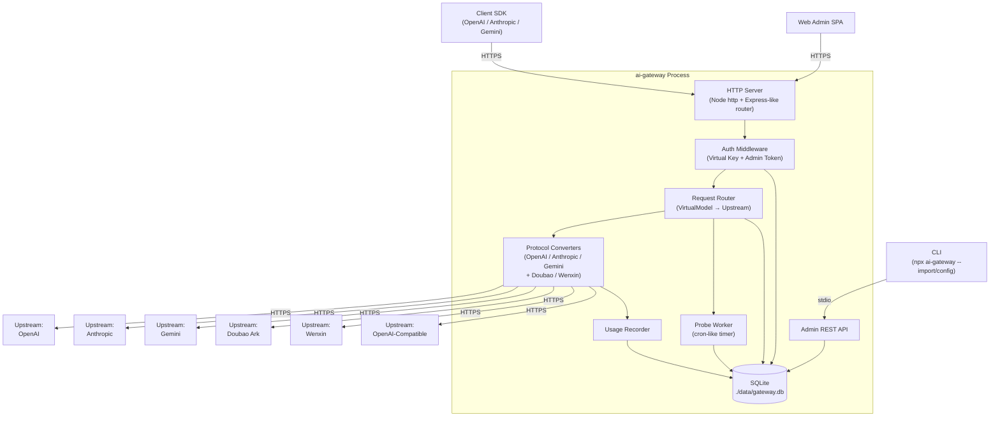
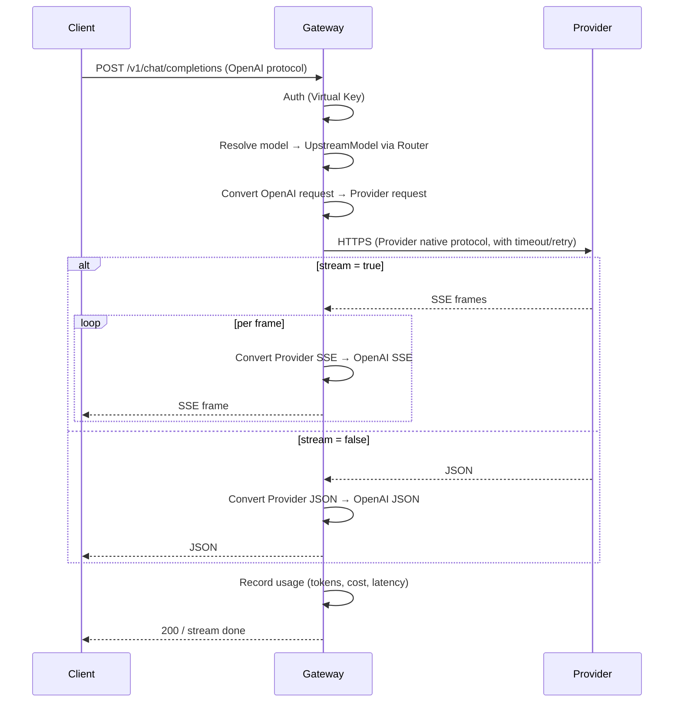

# AI Gateway — Technical Design

Feature Name: ai-gateway
Updated: 2026-08-25

## Description

`ai-gateway` 是本地优先的 npm 包形态 AI API 网关，单一 Node.js 进程承载 HTTP 客户端入口、协议转换、虚拟模型路由、Probe、Key 鉴权、用量计量、Web 管理后台与 CLI。它把 OpenAI、Anthropic、Google Gemini、豆包、文心等上游 Provider 聚合为三类客户端协议（OpenAI Chat Completions、Anthropic Messages、Gemini GenerateContent）的统一入口，按策略在多个 Upstream Model 间路由，并在故障时自动跳过不可用模型。

包通过 `npx ai-gateway` 启动，使用 better-sqlite3 持久化配置与用量。Web 后台以单文件 HTML + 原生 JS 实现，无前端构建步骤。CLI 与管理 REST API 暴露完全相同的配置能力。

## Architecture

### 分层视图



### 请求生命周期（客户端 → 上游 → 客户端）



### 协议转换矩阵

| Client \ Provider | OpenAI | OpenAI-Compatible | Anthropic | Gemini | Doubao | Wenxin |
|---|---|---|---|---|---|---|
| OpenAI | 直传 | 直传 | 转换 | 转换 | 转换 | 转换 |
| Anthropic | 转换 | 转换 | 直传 | 转换 | 转换 | 转换 |
| Gemini | 转换 | 转换 | 转换 | 直传 | 转换 | 转换 |

## Components and Interfaces

### 1. HTTP Server（`src/server/http.ts`）

- 基于 Node `http` 标准库 + 自研轻量路由（避免 Express 依赖，减少 npm 包体积）。
- 路由前缀：
  - `POST /v1/chat/completions` — OpenAI Chat Completions 入口
  - `POST /v1/messages` — Anthropic Messages 入口
  - `POST /v1/messages/count_tokens` — Anthropic Token 计数
  - `POST /v1beta/models/:model\\:action` — Gemini 入口（generateContent / streamGenerateContent / countTokens）
  - `GET /v1/models` — 模型列表
  - `GET /v1beta/models` — Gemini 模型列表
  - `GET /admin` — Web 后台入口（返回单文件 HTML）
  - `GET /admin/api/*` — 管理 REST API（受 Admin Token 保护）
  - `GET /healthz` — 存活探针
- 流式响应通过 `res.write` + `Content-Type: text/event-stream` 实现。

### 2. Auth Middleware（`src/server/middleware/auth.ts`）

- 解析 `Authorization: Bearer <key>`。
- 计算 SHA-256 摘要并查表。
- 校验 Key 状态（active/revoked）、rpm/tpm 限额、allowedModels 白名单。
- Admin Token 仅作用于 `/admin/*`，与 Virtual Key 分桶存储。

### 3. Request Router（`src/router/index.ts`）

- 解析请求体中的 `model` 字段，先匹配 VirtualModel，再回退到 UpstreamModel 直接转发。
- 根据 VirtualModel.strategy 选择 UpstreamMember：
  - `RoundRobin` — 进程内原子计数器。
  - `WeightedRandom` — 累计权重 + `crypto.randomInt`。
  - `Failover` — 按 priority 升序，跳过 unavailable。
  - `LowestLatency` — 滑动窗口（默认 5 次）平均延迟最低且 available 的成员。
- 若所有成员 unavailable，返回 502 `all_upstreams_unavailable`。

### 4. Protocol Converters（`src/converters/`）

每个 Converter 实现 `encodeRequest(clientReq, upstreamDef) → ProviderReq` 和 `decodeResponse(providerRes, isStream) → AsyncIterable<ClientEvent>`。

- `openai.ts` — OpenAI ↔ OpenAI 双向（基线）。
- `anthropic.ts` — Anthropic ↔ Anthropic + 反向生成。处理 system 数组拼接、thinking 字段、tool_use 流式增量（content_block_start / content_block_delta / content_block_stop、input_json_delta）。
- `gemini.ts` — Gemini GenerateContent 双向。处理 contents 角色映射、functionCall ↔ tool_calls、thought 字段透传。
- `doubao.ts` — 字节豆包 Ark：OpenAI 兼容但鉴权用 `Authorization: Bearer ${ARK_API_KEY}`，model id 为 `ep-xxx` 或 `doubao-xxx`，独立 baseUrl（默认 `https://ark.cn-beijing.volces.com/api/v3`）。
- `wenxin.ts` — 百度文心千帆：通过 OAuth2 client_credentials 获取 access_token，POST `{baseUrl}/v2/chat/completions`，body 字段差异（message 不支持 role=system 数组，需拼接）。
- `converter-bus.ts` — 选择 `(clientProtocol, providerProtocol)` 对应的实现，缺失时返回 unsupported_pair 错误。

### 5. Probe Worker（`src/probe/worker.ts`）

- 启动时建立 `setInterval`，间隔取自 `probeIntervalMinutes`（0 关闭）。
- 每轮遍历所有 enabled UpstreamModel，对每个发送最小化探测请求（OpenAI/Anthropic/Gemini 使用 `max_tokens: 1`；豆包、文心同样使用 1 token）。
- 写入 `probe_results` 表（latency、statusCode、success、errorMessage、probedAt）。
- 维护内存中的 `availabilityCache`：连续失败 ≥ failureThreshold → unavailable；连续成功 ≥ recoveryThreshold → available。
- 触发真实请求失败时同步调用 `availabilityCache.recordFailure(modelId)`，触发降级。

### 6. Usage Recorder（`src/usage/recorder.ts`）

- 在响应完成或 SSE `[DONE]` 时记录一行。
- 字段：requestId、keyId、virtualModelId、upstreamProviderId、upstreamModelId、promptTokens、completionTokens、cachedTokens、totalTokens、costUSD、source（reported/estimated）、latencyMs、statusCode、createdAt。
- costUSD = (promptTokens - cachedTokens) * inputPrice / 1e6 + cachedTokens * cachedInputPrice / 1e6 + completionTokens * outputPrice / 1e6。
- 估算规则：当上游未返回 usage 时按字符数 / 4 向下取整，source = estimated。

### 7. Admin REST API（`src/admin/api.ts`）

| Method | Path | 说明 |
|---|---|---|
| GET | `/admin/api/providers` | 列出所有 Provider |
| POST | `/admin/api/providers` | 新建 Provider |
| PATCH | `/admin/api/providers/:id` | 更新 Provider |
| DELETE | `/admin/api/providers/:id` | 删除 Provider |
| POST | `/admin/api/providers/:id/sync-models` | 触发模型同步 |
| GET | `/admin/api/virtual-models` | 列出虚拟模型 |
| POST | `/admin/api/virtual-models` | 创建虚拟模型 |
| GET | `/admin/api/keys` | 列出 Key（不返回明文） |
| POST | `/admin/api/keys` | 创建 Key（返回一次明文） |
| DELETE | `/admin/api/keys/:id` | 吊销 Key |
| GET | `/admin/api/usage?groupBy=...&range=...` | 用量聚合 |
| GET | `/admin/api/usage/timeseries?bucket=hour&range=24h` | 时序聚合 |
| GET | `/admin/api/stats/totals` | 总量统计（请求数、Token、费用、活跃 Key、平均延迟） |
| GET | `/admin/api/stats/distribution?dimension=provider\|model\|key&range=24h` | 占比分布 |
| GET | `/admin/api/stats/latency?range=24h` | P50/P95/P99 延迟分位数 |
| GET | `/admin/api/stats/error-rate?range=24h` | 错误率与错误码 Top10 |
| GET | `/admin/api/stats/top-models?limit=10&range=7d&by=cost\|tokens\|requests` | Top 模型榜单 |
| GET | `/admin/api/stats/heatmap?dimension=hour-of-day×day-of-week&range=30d` | 流量热力图 |
| POST | `/admin/api/test` | 发送一次真实请求用于连通性测试 |
| GET | `/admin/api/probe-results?modelId=...&range=24h` | 探测历史 |

### 8. CLI（`src/cli/index.ts`）

- `npx ai-gateway` — 启动服务。
- `npx ai-gateway --config <path>` — 以配置文件覆盖默认。
- `npx ai-gateway --import <path>` — 导入 JSON 配置后退出（用于初始化）。
- `npx ai-gateway --export <path>` — 导出当前配置到 JSON。
- `npx ai-gateway --reset-keys` — 清空所有 Key（带确认提示）。
- `npx ai-gateway --version` — 输出版本号。

### 9. Web Admin SPA（`web/index.html`）

- 单文件 HTML + 原生 ES2022 JS，无构建步骤。
- 七个 Tab：
  - **Overview** — 仪表盘（见下）
  - **Providers** — Provider CRUD + 模型同步
  - **Virtual Models** — 虚拟模型路由配置
  - **Keys** — Virtual Key 管理
  - **Usage** — 用量明细 + 时序图
  - **Probes** — 上游探测历史与延迟曲线
  - **Settings** — 全局参数（探测间隔、阈值、master key 重置）
- 走 `fetch('/admin/api/*')` + Admin Token（首次访问弹窗输入并存 `sessionStorage`）。
- 使用 `EventSource('/admin/api/logs/stream')`（可选）查看实时日志。

### 10. Dashboard 仪表盘（Overview Tab）

Overview Tab 默认进入，按 `range=24h` 加载七组指标，使用 SVG 自绘图表（不引入 Chart.js/ECharts，保持零依赖）。布局如下：

```
┌─────────────────────────────────────────────────────────────┐
│  [KPI 卡片] 总请求 / 总 Tokens / 总费用 / 活跃 Key / P95    │
├──────────────────────────┬──────────────────────────────────┤
│  时序面积图 (24h)        │  错误率折线 (24h)                │
│  Requests × Tokens       │                                  │
├──────────────────────────┼──────────────────────────────────┤
│  Provider 占比环形图     │  Top 模型柱状 (by cost)         │
├──────────────────────────┼──────────────────────────────────┤
│  P50/P95/P99 延迟柱      │  Key 用量 Top10 横向柱           │
├──────────────────────────┴──────────────────────────────────┤
│  30 天流量热力图 (hour × weekday)                            │
└─────────────────────────────────────────────────────────────┘
```

实现细节：

- 所有图表统一走 `src/web/charts/*.js`，每个图表一个独立 `render(svg, data)` 函数。
- 图表数据按 range 懒加载，切 range 时统一请求 `/admin/api/stats/*`。
- 数字滚动动画（200ms ease-out，从旧值到新值）。
- 颜色调色板：6 色调和板（紫/青/琥珀/红/绿/蓝），按 Provider id 哈希分配，保证稳定。
- 空态：当没有 usage 数据时显示「等待第一条请求」占位。

## Data Models

### SQLite Schema（`src/storage/schema.sql`）

```sql
CREATE TABLE providers (
  id TEXT PRIMARY KEY,
  name TEXT NOT NULL,
  protocol TEXT NOT NULL CHECK (protocol IN ('OpenAI','OpenAI-Compatible','Anthropic','Gemini','Doubao','Wenxin')),
  base_url TEXT NOT NULL,
  api_key_ciphertext TEXT NOT NULL,
  api_key_iv TEXT NOT NULL,
  api_key_tag TEXT NOT NULL,
  enabled INTEGER NOT NULL DEFAULT 1,
  input_price_per_mtokens_usd REAL,
  output_price_per_mtokens_usd REAL,
  cached_input_price_per_mtokens_usd REAL,
  extra_json TEXT,
  created_at INTEGER NOT NULL,
  updated_at INTEGER NOT NULL
);

CREATE TABLE provider_models (
  id TEXT PRIMARY KEY,
  provider_id TEXT NOT NULL REFERENCES providers(id) ON DELETE CASCADE,
  model_id TEXT NOT NULL,
  display_name TEXT,
  context_window INTEGER,
  supports_stream INTEGER NOT NULL DEFAULT 1,
  supports_tools INTEGER NOT NULL DEFAULT 1,
  supports_vision INTEGER NOT NULL DEFAULT 0,
  enabled INTEGER NOT NULL DEFAULT 1,
  created_at INTEGER NOT NULL,
  UNIQUE (provider_id, model_id)
);

CREATE TABLE virtual_models (
  id TEXT PRIMARY KEY,
  name TEXT NOT NULL UNIQUE,
  strategy TEXT NOT NULL CHECK (strategy IN ('RoundRobin','WeightedRandom','Failover','LowestLatency')),
  latency_window INTEGER DEFAULT 5,
  failure_threshold INTEGER DEFAULT 3,
  recovery_threshold INTEGER DEFAULT 2,
  created_at INTEGER NOT NULL
);

CREATE TABLE virtual_model_members (
  virtual_model_id TEXT NOT NULL REFERENCES virtual_models(id) ON DELETE CASCADE,
  upstream_model_id TEXT NOT NULL REFERENCES provider_models(id) ON DELETE CASCADE,
  weight INTEGER NOT NULL DEFAULT 1,
  priority INTEGER NOT NULL DEFAULT 100,
  PRIMARY KEY (virtual_model_id, upstream_model_id)
);

CREATE TABLE keys (
  id TEXT PRIMARY KEY,
  name TEXT NOT NULL,
  key_hash TEXT NOT NULL UNIQUE,
  prefix TEXT NOT NULL,
  status TEXT NOT NULL CHECK (status IN ('active','revoked')) DEFAULT 'active',
  rpm_limit INTEGER,
  tpm_limit INTEGER,
  allowed_models_json TEXT,
  created_at INTEGER NOT NULL,
  revoked_at INTEGER
);

CREATE TABLE probe_results (
  id INTEGER PRIMARY KEY AUTOINCREMENT,
  upstream_model_id TEXT NOT NULL,
  latency_ms INTEGER,
  status_code INTEGER,
  success INTEGER NOT NULL,
  error_message TEXT,
  probed_at INTEGER NOT NULL
);
CREATE INDEX idx_probe_results_model_time ON probe_results(upstream_model_id, probed_at DESC);

CREATE TABLE usage_records (
  id INTEGER PRIMARY KEY AUTOINCREMENT,
  request_id TEXT NOT NULL,
  key_id TEXT,
  virtual_model_id TEXT,
  upstream_provider_id TEXT,
  upstream_model_id TEXT,
  client_protocol TEXT NOT NULL,
  prompt_tokens INTEGER NOT NULL DEFAULT 0,
  completion_tokens INTEGER NOT NULL DEFAULT 0,
  cached_tokens INTEGER NOT NULL DEFAULT 0,
  total_tokens INTEGER NOT NULL DEFAULT 0,
  cost_usd REAL NOT NULL DEFAULT 0,
  source TEXT NOT NULL CHECK (source IN ('reported','estimated')),
  latency_ms INTEGER NOT NULL,
  status_code INTEGER NOT NULL,
  error_code TEXT,
  created_at INTEGER NOT NULL
);
CREATE INDEX idx_usage_created_at ON usage_records(created_at DESC);
CREATE INDEX idx_usage_key_created ON usage_records(key_id, created_at DESC);
CREATE INDEX idx_usage_upstream_created ON usage_records(upstream_model_id, created_at DESC);

CREATE TABLE schema_version (
  version INTEGER PRIMARY KEY
);
```

### 内存数据结构

- `availabilityCache: Map<upstreamModelId, { status, consecutiveFailures, consecutiveSuccesses }>` — Probe 与 Router 共用。
- `rpmTpmWindow: Map<keyId, { windowStart, requestCount, tokenCount }>` — 每 60 秒滚动一次。
- `roundRobinCounters: Map<virtualModelId, number>` — Round Robin 计数。

### 配置示例（`gateway.config.json`）

```json
{
  "port": 3000,
  "adminToken": "set-on-first-startup",
  "adminEnabled": true,
  "probeIntervalMinutes": 15,
  "failureThreshold": 3,
  "recoveryThreshold": 2,
  "providers": [
    {
      "name": "openai-official",
      "protocol": "OpenAI",
      "baseUrl": "https://api.openai.com/v1",
      "apiKey": "sk-...",
      "inputPricePerMTokensUsd": 2.5,
      "outputPricePerMTokensUsd": 10.0
    },
    {
      "name": "anthropic-official",
      "protocol": "Anthropic",
      "baseUrl": "https://api.anthropic.com",
      "apiKey": "sk-ant-...",
      "inputPricePerMTokensUsd": 3.0,
      "outputPricePerMTokensUsd": 15.0
    },
    {
      "name": "doubao-ark",
      "protocol": "Doubao",
      "baseUrl": "https://ark.cn-beijing.volces.com/api/v3",
      "apiKey": "...",
      "models": [
        { "modelId": "doubao-pro-32k", "displayName": "豆包 Pro 32K" }
      ]
    }
  ],
  "virtualModels": [
    {
      "name": "smart",
      "strategy": "Failover",
      "members": [
        { "upstreamModelRef": "openai-official/gpt-4o", "priority": 1 },
        { "upstreamModelRef": "anthropic-official/claude-sonnet-4-5", "priority": 2 }
      ]
    }
  ],
  "keys": [
    {
      "name": "team-a",
      "rpmLimit": 60,
      "tpmLimit": 1000000
    }
  ]
}
```

## Correctness Properties

1. **协议一致性**：Client Protocol 响应体的字段集是上游 Provider 协议字段集的超集（多余字段以 `X-Gateway-Forwarded-*` 头暴露，正文仅含 Client Protocol 标准字段）。
2. **Token 守恒**：response 中 `usage.prompt_tokens + usage.completion_tokens == usage.total_tokens`，流式结束时累计 total_tokens 等于非流式一次性返回的 total_tokens。
3. **路由不变量**：一次请求最多触发一次 UpstreamModel 选择；切换协议或路由时不修改已发出的 HTTP 请求体。
4. **可用性不变量**：当 UpstreamModel 状态为 unavailable，Router SHALL 不将其纳入选择；当所有成员 unavailable，Router SHALL 返回 502。
5. **幂等性**：相同请求体的非流式请求两次，Token Usage 差异不超过 5%（Provider 自身的随机性范围）。
6. **加密不变量**：`providers.api_key_ciphertext` 不可被无主密钥进程解密；`keys.key_hash` 不可被反向为 Key 明文。
7. **降级不变量**：当首选 Provider 不可用时，Failover 策略 SHALL 在 1 次重试内切换至次选，且对客户端表现为单次请求完成时间不显著增长。
8. **统计一致性**：Overview 仪表盘 KPI 卡片四个数字（总请求、总 Tokens、总费用、P95）的累加值 SHALL 等于 `GET /admin/api/usage` 在同 range 下 groupBy=day 的累加值（误差 ≤ 0.01 USD / 1 token）。
9. **时序对齐**：`/stats/totals` 与 `/usage/timeseries` 在同一 range 下的桶边界 SHALL 一致，跨源不会出现同一时刻两个不同的总数。

## Error Handling

### 错误分类

| 类别 | HTTP Status | 错误码 | 处理 |
|---|---|---|---|
| 鉴权失败 | 401 | `invalid_key` / `missing_authorization` | 原样返回 |
| Key 限额超限 | 429 | `rate_limit_exceeded` / `token_quota_exceeded` | 返回 Retry-After |
| 模型不存在 / 不允许 | 404 / 403 | `model_not_found` / `model_not_allowed` | 原样返回 |
| 协议转换不支持 | 400 | `unsupported_protocol_pair` | 返回详细解释 |
| 上游 4xx | 透传 | 透传 | 包成 Client Protocol 错误体 |
| 上游 5xx | 502 | `upstream_5xx` | 触发 Failover / 记录探测失败 |
| 上游超时 | 504 | `upstream_timeout` | 触发 Failover |
| 全部上游失败 | 502 | `all_upstreams_unavailable` | 返回 |
| 内部错误 | 500 | `internal_error` | 记录日志，不暴露堆栈 |

### Client Protocol 错误体构造

- OpenAI: `{ error: { type, code, message, param } }`
- Anthropic: `{ type: "error", error: { type, message } }`
- Gemini: `{ error: { code, message, status } }`

错误体构造器在 `src/converters/errors.ts`，按 Client Protocol 输出对应字段。

### 流式中断

- 中途连接断开：SSE 流尾追加一条 Client Protocol error 事件，最后再发 `data: [DONE]`（OpenAI/Gemini）或 Anthropic `message_stop` 之前先发 `error` 事件。
- 客户端取消：监听 `req.aborted`，主动关闭上游连接，usage 表写入 statusCode=499。

## Test Strategy

### 单元测试（`test/unit/`，vitest）

- 协议转换器：每个 Converter 与 Client×Provider 组合至少 1 组 fixture，覆盖：
  - 非流式、文本、tools、tool_choice、system、stream、temperature、max_tokens、top_p、response_format
  - 流式：OpenAI `delta.content` / `delta.tool_calls`、Anthropic `content_block_start` + `input_json_delta`、Gemini `candidates[0].content.parts[].text` 与 `functionCall`
  - thinking / reasoning 字段
  - 错误响应：401 / 429 / 500 / 502 / 504
- Router：4 种 strategy 各 5 个 case，含 unavailable 跳过、weight=0、latencyWindow=0、单成员。
- Probe Worker：连续失败达到 failureThreshold 触发降级，连续成功达到 recoveryThreshold 恢复。
- Usage Recorder：reported 与 estimated 两条路径、cost 计算含 cachedTokens。
- Key 鉴权：明文 vs hash、revoked、限额、白名单。

### 集成测试（`test/integration/`，vitest + 自建 mock provider）

- 起一个 mock HTTP server（Node `http`）模拟 OpenAI / Anthropic / Gemini / Doubao / Wenxin 五类 Provider，每个 Provider 提供：
  - `/v1/chat/completions` 或 `/v1/messages` 或 `generateContent` 三个端点
  - 一组 fixture（流式 + 非流式 + 错误）
- 用 nock 风格的桩函数替换 `https.request`，跑 `src/server/http.ts` 在端口 0 上启动。
- 场景：
  - OpenAI client → Anthropic provider（含 tool_use 完整来回）
  - Anthropic client → OpenAI provider（含 thinking）
  - Gemini client → OpenAI provider
  - 客户端 SSE → 上游非 SSE 适配
  - Failover 路由：首选 502，验证自动切次选
  - Key 限额：100 RPM 触发 429

### 端到端兼容测试（`test/e2e/`）

- 通过真实 CLI（`anthropic` SDK、OpenAI Node SDK、Google Generative AI SDK）以子进程形式调用 Gateway。
- Claude Code / Cursor / Cline 兼容矩阵：
  - 用 `@anthropic-ai/sdk` 模拟 Claude Code 调用 Anthropic 入口 → 转发到 OpenAI Provider，断言 tool_use 双向正确。
  - 用 `openai` SDK 模拟 Cursor 调用 OpenAI 入口 → 转发到 Anthropic Provider，断言 stream chunk 格式正确。
  - 用 `openai` SDK 模拟 Cline 调用 OpenAI 入口 → 转发到 Gemini Provider，断言 function_call 完整来回。

### 端到端探测测试

- 用 `npm pack` 打包本地 tarball，`npm install -g ./ai-gateway-x.y.z.tgz` 后跑 `ai-gateway --version`。
- 用 `lsof -i :3000` 验证端口监听、进程可被 SIGTERM 优雅关闭。

### 覆盖率门槛

- 单元 + 集成行覆盖率 ≥ 80%，分支覆盖率 ≥ 70%。
- 协议转换器单独覆盖率 ≥ 90%（转换错误代价高）。

## References

[^1]: LiteLLM Proxy 设计参考 — https://docs.litellm.ai/docs/proxy/quick_start
[^2]: ai-api-gateway npm 包设计参考 — https://www.npmjs.com/package/ai-api-gateway
[^3]: Anthropic Messages API 与流式规范 — https://docs.anthropic.com/en/api/messages-streaming
[^4]: Google Gemini OpenAI 兼容说明 — https://ai.google.dev/gemini-api/docs/openai
[^5]: 字节豆包 Ark 接入文档 — https://www.volcengine.com/docs/82379
[^6]: 百度智能云千帆 ModelBuilder — https://cloud.baidu.com/doc/WENXINWORKSHOP/s/hlrk4akp7
[^7]: Claude Code 兼容要求（Anthropic 官方 OpenAI 兼容说明的限制提示）— https://docs.anthropic.com/en/api/openai-sdk
[^8]: Cloudflare AI Gateway 局限（用于反面案例）— https://developers.cloudflare.com/ai-gateway/